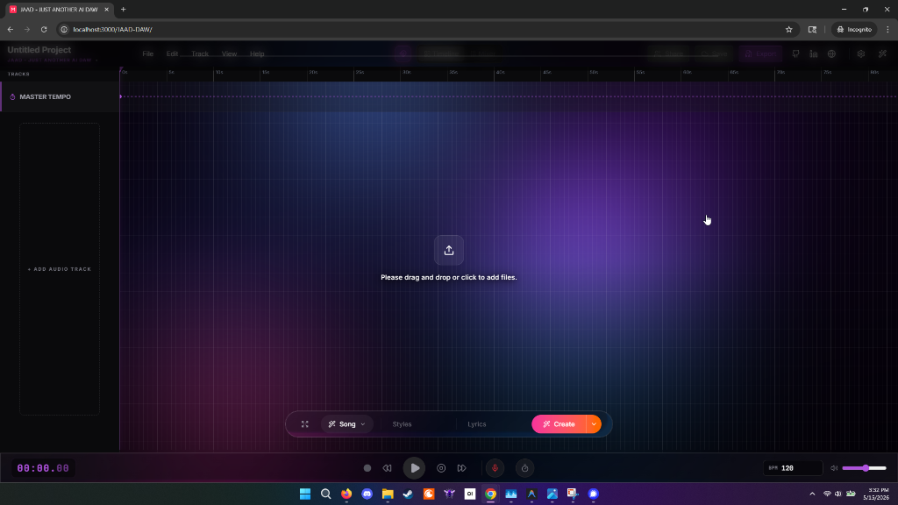
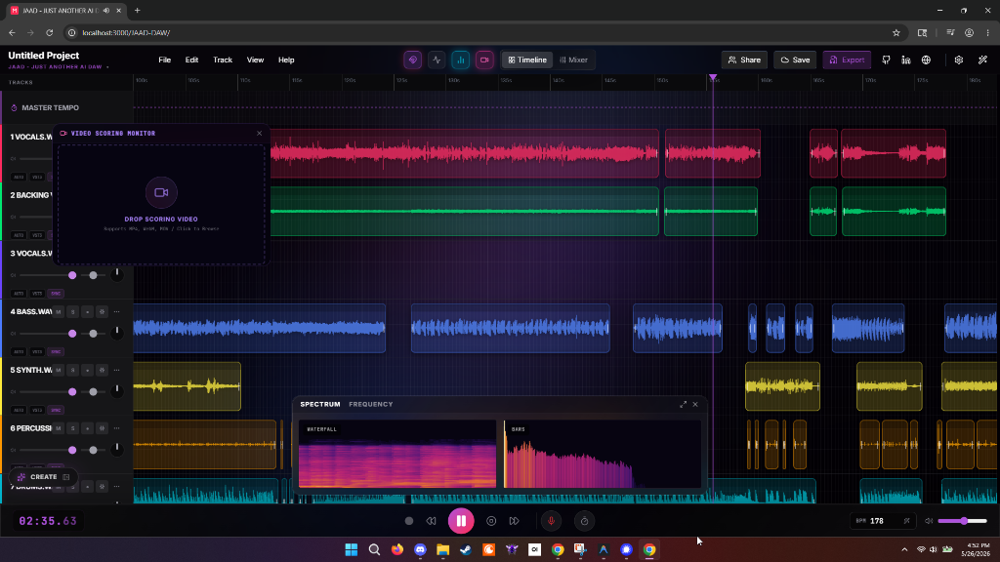
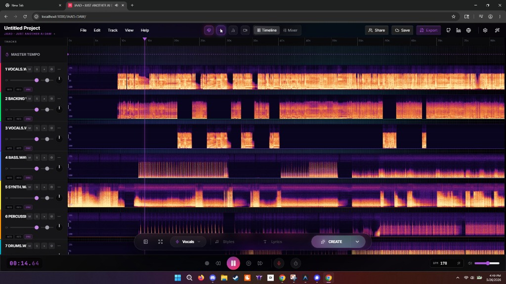
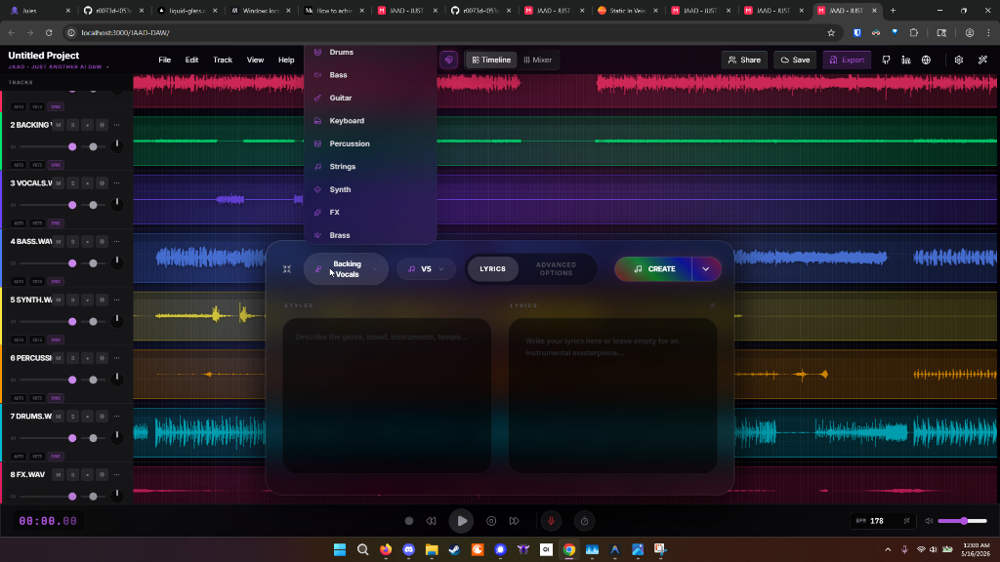
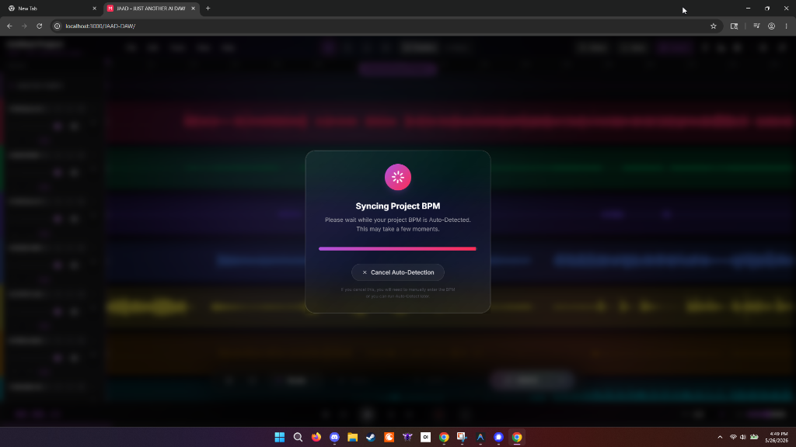

# Just Another AI DAW (JAAD)


### [Test JAAD!](https://r0073d-l053r.github.io/JAAD-DAW/)

Just Another AI DAW (JAAD) is a modern, web-browser-based Digital Audio Workstation built with React and the Web Audio API. It focuses on providing a fast, intuitive, and AI-enhanced experience for music production and audio editing directly in the browser—no installation required.

> **⚠️ Important Note:** This project is currently in an **early alpha build**. It is under active development and is not yet a stable production release. You may encounter bugs, incomplete features, and unexpected behavior.
>
> **🌐 Browser Compatibility:** This project is designed to perform at its best when using a **Google Chrome** browser. While other modern browsers may work, Chrome provides the most stable and performant environment for the Web Audio engine and high-fidelity animations.


## Screenshots

<div align="center">
  <h3>1. Sleek Empty Timeline Workspace</h3>
  
  <br/><br/>
  
  <h3>2. Multitrack Editor with Video Scoring Monitor</h3>
  
  <br/><br/>

  <h3>3. Multitrack Spectrogram Analysis</h3>
  
  <br/><br/>

  <h3>4. Generative AI Copilot & Vocal Styles</h3>
  
  <br/><br/>

  <h3>5. Syncing Project BPM Loading Overlay</h3>
  
</div>

## Features

- **AudioWorklet DSP Playback Engine**: Low-latency, ultra-smooth tempo-shifted audio playback utilizing a custom `soundtouch-processor` running on a dedicated hardware audio thread.
- **Local-First OPFS & IndexedDB Caching**: Implemented a highly optimized dual-stage caching layer utilizing Origin Private File System and IndexedDB for offline-ready, lightning-fast storage of large audio assets (GBs of WAVs).
- **Gated Cloud Collaboration & Deep Links**: Share projects instantly via unique collaborative URLs (`?project=PROJECT_ID`). Gated by manual cloud saving to guarantee all tracks, audio assets, and project configurations are synced.
- **Hybrid BPM Detection Engine**: Integrated `essentia.js` for fast offline tempo analysis with an automatic Gemini AI fallback to calculate track BPM dynamically and sync it with WebGL visuals.
- **Generative AI Copilot & Creation**: Natural language generation of audio stems, lyrics-to-vocals, and MIDI patterns directly onto the timeline, powered by Google Gemini.
- **AI "Fix My Mix" Automator**: One-click intelligent analysis that applies corrective parametric EQ, multi-band compression, and mastering presets.
- **Interactive Timeline & Mixer**: Complete DAW workspace with dynamic resizing, volume/panning faders, mute, solo, and real-time routing buses.
- **Demo Protection & Onboarding**: Shielded read-only templates on public hosted builds with automatic copy-on-edit logic, complemented by a premium Glassmorphism onboarding Welcome Modal.
- **Forced Cloud Sync Overlay**: Blocking Liquid Glass progress overlay with exponential backoff upload retry logic ensures your assets are safely backed up.
- **Exporting Options**: Export your final project as a high-fidelity `.WAV` mixdown, individual multitrack stems in a `.ZIP` file, or a portable `.JAAD` bundle.
- **Customizable Project Naming & Settings**: Inline project renaming, audio interface buffer settings, MIDI configuration, and theme customizations.

## Technology Stack

- **Core Framework**: React 19 + Vite + TypeScript
- **State Management**: React Context + Custom Store Architecture
- **Styling & UI**: Tailwind CSS + Custom Liquid Glass Design Tokens
- **Animations**: Motion (Framer Motion) + WebGL Fragment Shader Backgrounds
- **Audio & DSP Engine**: Web Audio API + SoundTouch AudioWorklet + Wasm SIMD
- **Analysis Algorithms**: essentia.js (BPM)
- **Local Persistence**: Origin Private File System (OPFS) + IndexedDB
- **Cloud Backend**: Firebase (Firestore Real-time Sync, Auth, Storage)
- **File Utilities**: JSZip (.jaad & stem bundles)
- **Icons**: Lucide React

## Getting Started

### Prerequisites

You need Node.js installed on your machine.

### Installation

1. Clone the repository:
   ```bash
   git clone https://github.com/r0073d-l053r/JAAD-DAW.git
   cd JAAD-DAW
   ```
   *(Note: Ensure you are in the `JAAD-DAW` directory before running the following commands.)*

2. Set up your environment variables:
   Copy the example environment file and add your configuration (e.g. `GEMINI_API_KEY`).
   ```bash
   cp .env.example .env
   ```

3. Install dependencies:
   ```bash
   npm install
   ```

4. Build for production:
   *(Note: A production build is best to run the first time or after updates.)*
   ```bash
   npm run build
   ```
   The compiled files will be located in the `dist` directory.

5. Start the development server:
   ```bash
   npm run dev
   ```

6. Open your browser and navigate to `http://localhost:3000`.

### Running with Docker

You can easily self-host JAAD using Docker and Docker Compose. This ensures a consistent environment and serves the production build out of the box.

1. Make sure you have your `.env` file configured with your `GEMINI_API_KEY`.
2. Build and start the container in detached mode:
   ```bash
   docker-compose up -d --build
   ```
3. Open your browser and navigate to `http://localhost:3000`.

To stop the container, run:
```bash
docker-compose down
```

## Keyboard Shortcuts

| Shortcut | Action |
|----------|--------|
| `Space` | Play / Pause |
| `R` | Toggle Record |
| `S` | Split Clip at Playhead |
| `Ctrl/Cmd + C` | Copy Selected Clips |
| `Ctrl/Cmd + X` | Cut Selected Clips |
| `Ctrl/Cmd + V` | Paste Clips at Playhead |
| `Del` | Delete Selected Clips |
| `Ctrl/Cmd + Z` | Undo |
| `Ctrl/Cmd + Y` | Redo |
| `Ctrl/Cmd + A` | Select All Clips |
| `Ctrl + Shift + S` | Cleanup Stems |
| `Tab` / `F9` | Toggle Mixer View |
| `Ctrl + Shift + Scroll` | Zoom In / Out |

## Roadmap

- [x] **Complete MIDI Support** & Interactive Piano Roll Integration
- [x] **VST/AudioUnit Emulation** via WebAssembly Wrapper
- [x] **Real-time Collaborative Sync** (Firestore Database Sync & Delta Caching)
- [x] **Advanced AI Features** (Stem Separation, Automatic Mastering, essentia.js BPM Detection)
- [x] **Fully Gated Cloud Share & Deep Link System** with Firebase Integration
- [x] **AudioWorklet Playback Pipeline** for glitch-free performance
- [x] **High-Performance Caching** via OPFS (Origin Private File System)
- [ ] **Multiplayer Audio Streaming** (Real-time voice and audio sharing via WebRTC)
- [ ] **Mobile Touch-Optimized Layout** & Gesture Controls


## Contributing

Contributions are welcome! Please feel free to submit a Pull Request.  
1. Fork the Project
2. Create your Feature Branch (`git checkout -b feature/AmazingFeature`)
3. Commit your Changes (`git commit -m 'Add some AmazingFeature'`)
4. Push to the Branch (`git push origin feature/AmazingFeature`)
5. Open a Pull Request

## License and Editions

**JAAD Community Edition**  
This repository contains the completely open-source "Community Edition" of JAAD, licensed under the [MIT License](LICENSE). This version is free to use, modify, and self-host. It is designed with a "Bring Your Own API Key" approach for all AI features.

**JAAD Pro (Upcoming Desktop Release)**  
While this core web repository will remain free and open-source, we plan to offer a premium "Pro" subscription model in the future. The Pro desktop application will include exclusive features, bundled AI API access, and advanced capabilities under a separate commercial license.
