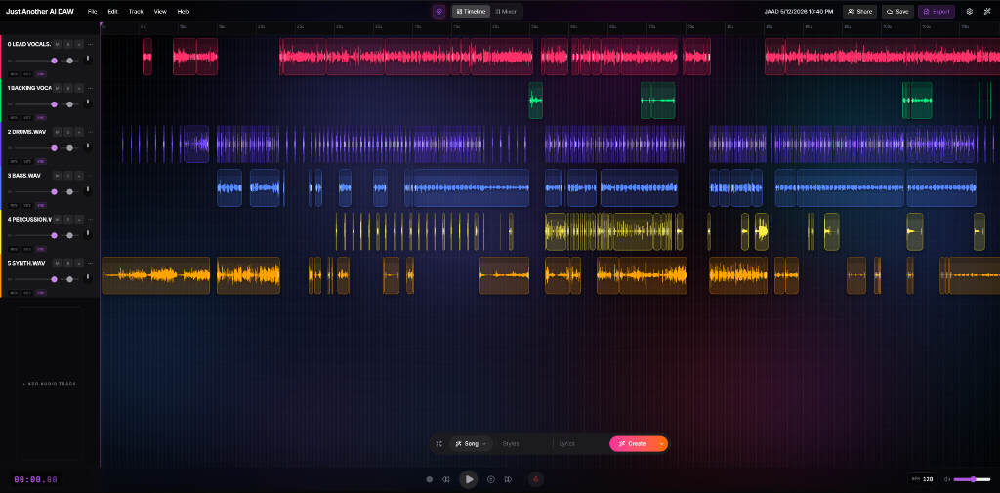

# Just Another AI DAW (JAAD)


Just Another AI DAW (JAAD) is a modern, web-browser-based Digital Audio Workstation built with React and the Web Audio API. It focuses on providing a fast, intuitive, and AI-enhanced experience for music production and audio editing directly in the browser—no installation required.

## Screenshots

<div align="center">
  
</div>

<br/>

<div align="center">
  
</div>

<br/>

<div align="center">
  
</div>

## Features

- **Multitrack Audio Editing**: Add, arrange, and edit audio clips across multiple tracks and lanes.
- **Web Audio Engine**: High-performance audio playback and manipulation entirely in the browser.
- **Drag and Drop / Import**: Easily drag and drop audio files directly into the timeline.
- **Real-time Background Animation**: Immersive, performant visuals that respond to the app state (can be toggled for performance).
- **Time Selection & Looping**: Select specific regions of time and loop playback seamlessly.
- **Stem Cleanup Tool**: Automatically detect and remove silence from your stems to tidy up your mix.
- **Exporting Options**: Export your final project as a high-fidelity `.WAV` mixdown or as individual multitrack stems in a `.ZIP` file.
- **Customizable Project Naming**: Rename your projects at any time. Naming persists in exports.
- **Keyboard Shortcuts**: Complete coverage of essential editing actions for a fast workflow.
- **AI Integration (Beta)**: Built-in scaffolding for intelligent audio processing, stem separation, and generative UI assistance.

## Technology Stack

- **Frontend Framework**: React 19 + Vite
- **Styling**: Tailwind CSS
- **Icons**: Lucide React
- **Animations**: Motion (Framer Motion)
- **Audio Processing**: Web Audio API
- **Zip Generation**: JSZip
- **Language**: TypeScript

## Getting Started

### Prerequisites

You need Node.js installed on your machine.

### Installation

1. Clone the repository:
   ```bash
   git clone https://github.com/r0073d-l053r/JAAD.git
   cd JAAD
   ```
   *(Note: Ensure you are in the `JAAD` directory before running the following commands.)*

2. Set up your environment variables:
   Copy the example environment file and add your configuration (e.g. `GEMINI_API_KEY`).
   ```bash
   cp .env.example .env
   ```

3. Install dependencies:
   ```bash
   npm install
   ```

4. Build for production:
   *(Note: A production build is best to run the first time or after updates.)*
   ```bash
   npm run build
   ```
   The compiled files will be located in the `dist` directory.

5. Start the development server:
   ```bash
   npm run dev
   ```

6. Open your browser and navigate to `http://localhost:3000`.

## Keyboard Shortcuts

| Shortcut | Action |
|----------|--------|
| `Space` | Play / Pause |
| `R` | Toggle Record |
| `S` | Split Clip at Playhead |
| `Ctrl/Cmd + C` | Copy Selected Clips |
| `Ctrl/Cmd + X` | Cut Selected Clips |
| `Ctrl/Cmd + V` | Paste Clips at Playhead |
| `Del` | Delete Selected Clips |
| `Ctrl/Cmd + Z` | Undo |
| `Ctrl/Cmd + Y` | Redo |
| `Ctrl/Cmd + A` | Select All Clips |
| `Ctrl + Shift + S` | Clean Up Stems |
| `F9` | Toggle Mixer View |

## Roadmap

- [ ] Complete MIDI support and piano roll integration
- [ ] VST/AudioUnit plugin emulation via WebAssembly
- [ ] Fully implemented Real-time Collaboration (WebSockets/WebRTC)
- [ ] Advanced AI features (style transfer, automatic mastering, noise reduction)
- [ ] Cloud save via Firebase integration

## Contributing

Contributions are welcome! Please feel free to submit a Pull Request.  
1. Fork the Project
2. Create your Feature Branch (`git checkout -b feature/AmazingFeature`)
3. Commit your Changes (`git commit -m 'Add some AmazingFeature'`)
4. Push to the Branch (`git push origin feature/AmazingFeature`)
5. Open a Pull Request

## License

This project is licensed under the MIT License - see the LICENSE file for details.
