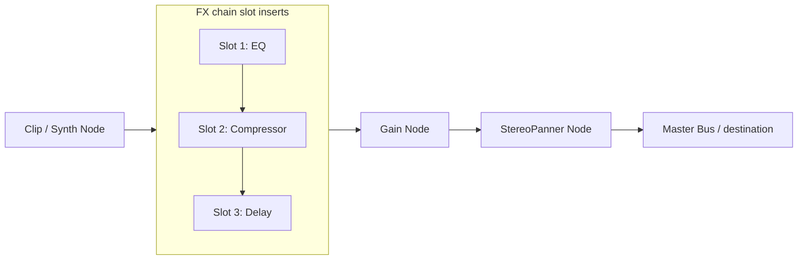

# ADR-0002: Web Audio API Real-time FX Pipeline

- **Status**: 🟡 Proposed
- **Date**: 2026-05-20
- **Author**: Antigravity & USER

## Context & Problem Statement

To become a production-ready DAW, JAAD must support professional audio mixing effects beyond plain volume faders. Users need real-time, customizable sound modification tools. We must build and integrate three core effects:
1. **WebEQ**: A multi-band parametric equalizer.
2. **WebCompressor**: A dynamic range processor.
3. **WebDelay**: A feedback delay line.

Additionally, tracks must support **FX Slots** to allow loading, bypass, ordering, and unloading of these effects in a modular chain.

## Proposed Decision

We will design a modular Web Audio API effect chain pipeline integrated into the existing `audioEngine.ts` and `store.tsx` architecture.

### 1. Web Audio Routing Topology

For each track, we will construct an effects chain insertion point between the track's source nodes and the track's main volume/panning nodes:



### 2. Individual Effects Architecture

- **WebEQ (BiquadFilterNodes)**:
  - Consists of three `BiquadFilterNode` instances in series: Low-shelf (100Hz), Peaking/Mid (1000Hz), High-shelf (5000Hz).
  - Controlled by frequency sliders, gain sliders, and Q factors.
  - Features visual frequency response curve rendering using `getFrequencyResponse()`.
- **WebCompressor (DynamicsCompressorNode)**:
  - Standard `DynamicsCompressorNode` exposure (Threshold, Ratio, Attack, Release, Knee).
  - Implement a real-time gain-reduction meter using periodic polling of the compressor node's `.reduction` value.
- **WebDelay (DelayNode + GainNode)**:
  - Feedback delay line topology:
    ```
    Input --> [Splitter/Merger] --> DelayNode --> FeedbackGainNode --> Input
    ```
  - Sync with project tempo (`state.bpm`) to calculate beat divisions (e.g. 1/4 note, 1/8 note).

### 3. FX Slot State Management

The track model in `store.tsx` will be extended to support a serial array of effects:
```typescript
interface EffectState {
  id: string;
  type: 'eq' | 'compressor' | 'delay';
  bypass: boolean;
  params: Record<string, number>;
}

// Extended Track Interface
interface Track {
  id: string;
  name: string;
  // ... existing fields
  effects: EffectState[];
}
```
- Adding/removing an effect re-creates and re-routes the Web Audio node sub-graph for that track in `audioEngine.ts`.
- Bypassing an effect routes the signal around that specific effect's sub-graph.

## Alternatives Considered

- **Pre-baked Server-side Rendering**: Running effects offline in a node/WASM microservice. *Rejected* due to latency and loss of interactive real-time control.
- **Single-Node Static Chain**: Hardcoding an EQ, Compressor, and Delay on every track regardless of usage. *Rejected* because of CPU overhead; idle Web Audio nodes consume resources. Modular slot instantiations are far more optimal.

## Consequences

- **Positive / What We Gain**:
  - Real-time, low-latency, responsive mixing controls.
  - Highly interactive UI with visual feedback (EQ curves and GR meters).
  - Scalable: new effects (reverb, chorus, distortion) can be added as modules adhering to the FX slot schema.
- **Negative / Trade-offs**:
  - Re-routing Web Audio connections dynamically on adding/removing effects can cause minor click artifacts if not carefully scheduled with gain ramp-downs.
  - Multi-band EQs and complex delays increase CPU load, potentially impacting mobile web performance.
